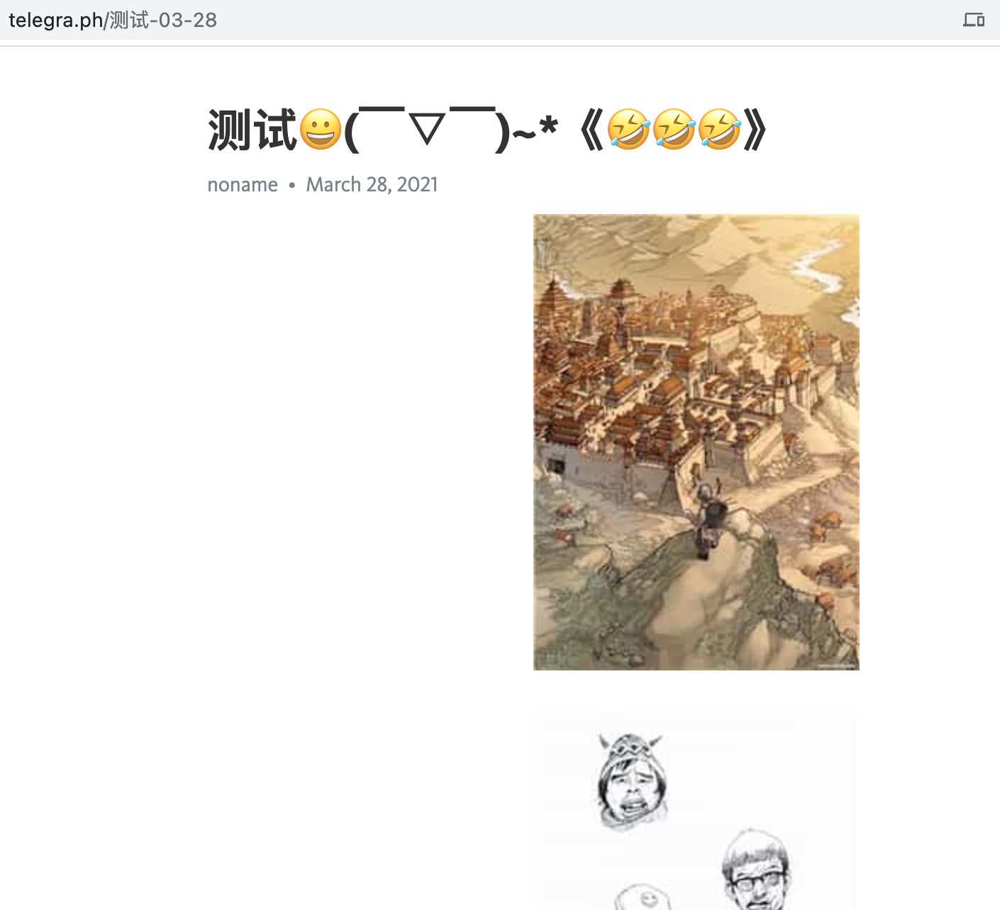
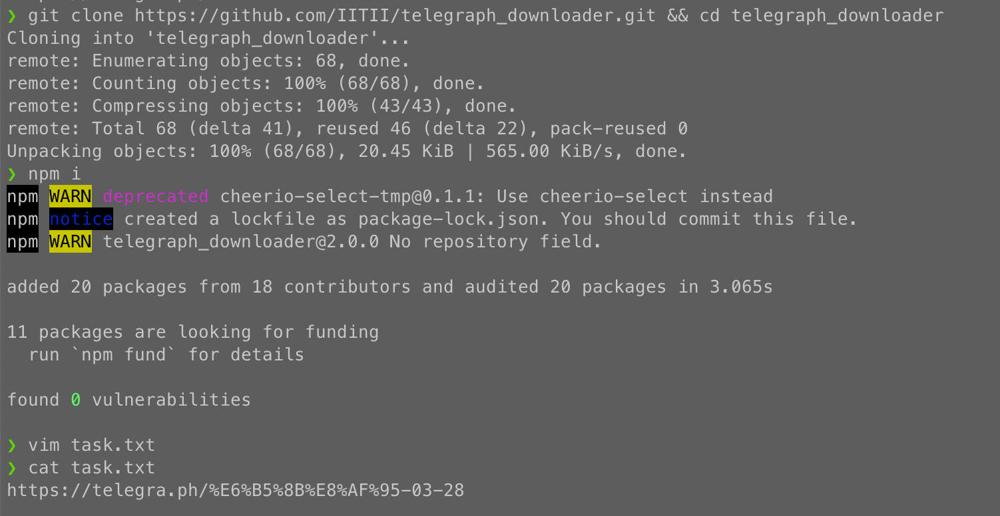
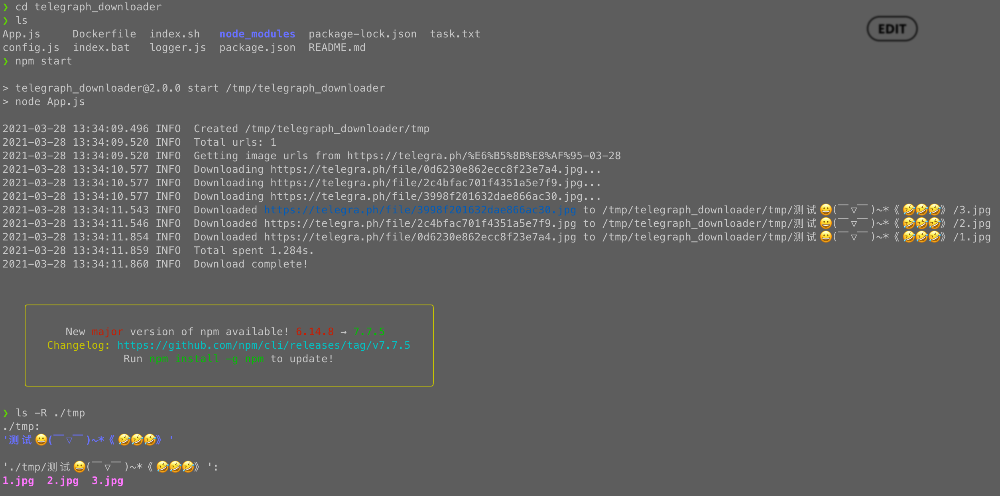
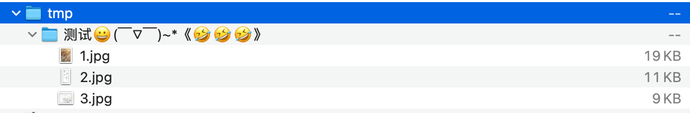

# Telegraph_downloader

> cheerio  
> nodejs

[English](./README.md) | [简体中文](./README_CN.md)

* A simple downloader for Telegraph

# Use

1. `git clone`
2. `npm i`
3. create & modify `task.txt`, just put your url links in it
4. `npm start`

# Example

1. Create a telegraph url for test

> Test URL: [https://telegra.ph/%E6%B5%8B%E8%AF%95-03-28](https://telegra.ph/%E6%B5%8B%E8%AF%95-03-28)



2. Login to your server or computer
3. Open Terminal
4. Install dependencies: `sudo apt-get update && sudo apt-get install -y git && sudo apt-get install -y nodejs npm`

> You can install node env via [NVM](https://github.com/nvm-sh/nvm#installing-and-updating) too.  
> `curl -o- https://raw.githubusercontent.com/nvm-sh/nvm/v0.37.2/install.sh | bash`

5. Clone project: `git clone https://github.com/IITII/telegraph_downloader.git && cd telegraph_downloader`
6. Install project dependencies: `npm i`
7. Create & modify `task.txt`, just put your url links in it. `vim task.txt`

> Copy & paste the test url (or other urls from the browser's address bar) to the file



8. Run. `npm start`
9. Check download files. `ls -R ./tmp`



10. Compress files: `tar -cvf tmp.tar ./tmp`

```zsh
❯ tar -cvf tmp.tar tmp
tmp/
tmp/测试😀(￣▽￣)~*《🤣🤣🤣》/
tmp/测试😀(￣▽￣)~*《🤣🤣🤣》/3.jpg
tmp/测试😀(￣▽￣)~*《🤣🤣🤣》/2.jpg
tmp/测试😀(￣▽￣)~*《🤣🤣🤣》/1.jpg
```

11. Download archive to your computer, decompress archive



12. Test pass

# Know issues

1. ~~Image maybe broken under high concurrency~~ (fixed)

> Some ways: async.queue async.mapLimit

2. ~~Maybe not support Chinese~~ (fixed)

> 1. Linux server don't install special language package
> 2. it's some problem of your software
> 3. Just package the downloaded files via `tar` or others.
     > Download this archive to your computer.
> Then unarchived it, everything goes well.  

# config.json

|     key     |            Description            |         default          |
| :---------: | :-------------------------------: | :----------------------: |
| downloadDir |        Images download dir        |         `./tmp`          |
|    limit    |         Concurrency Limit         |           `10`           |
|    proxy    |            Http proxy             | `Following System proxy` |
|    links    | A file which store download Links |        `task.txt`        |
