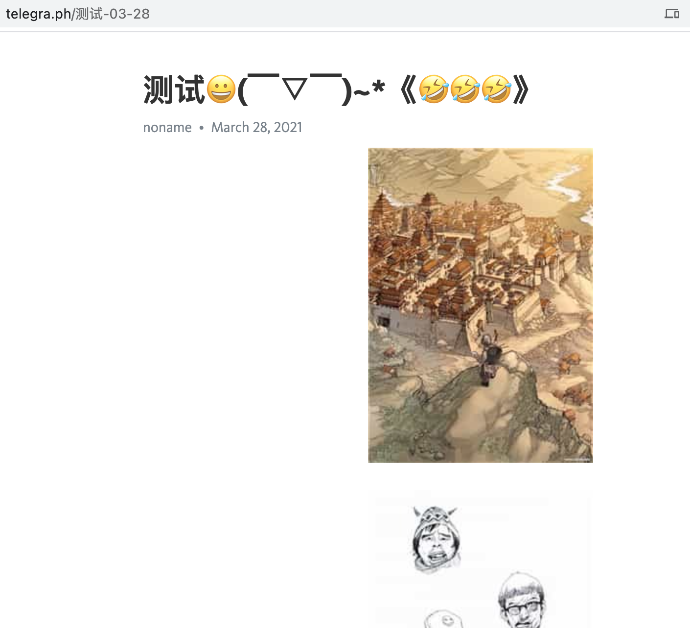
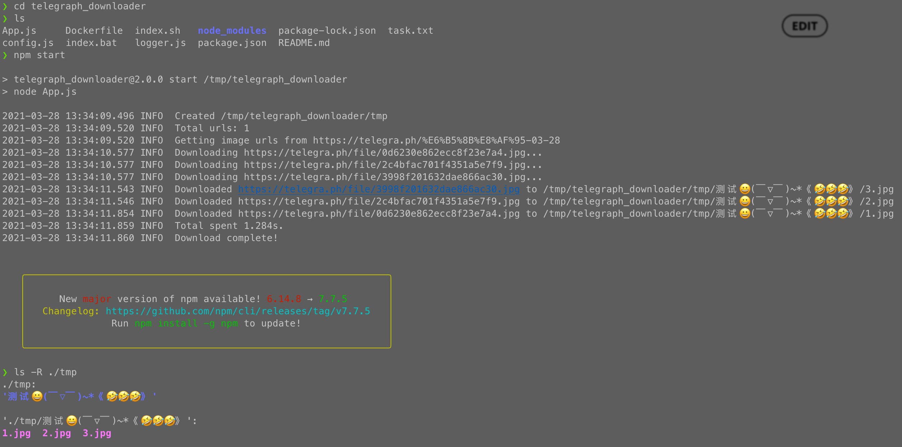
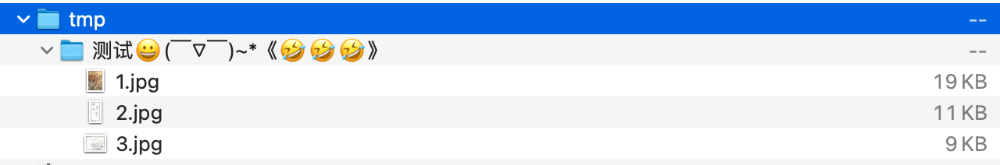

# Telegraph_downloader

> cheerio  
> nodejs

[English](./README.md) | [简体中文](./README_CN.md)

* 一个简单的 telegraph 下载器

# 使用

1. `git clone`
2. `npm i`
3. 创建并修改文件 `task.txt`, 将 telegraph URL 链接填入其中（一行一条）`vim task.txt`
4. `npm start`

# 示例

1. 创建一个测试用的 telegraph 链接

> 测试链接: [https://telegra.ph/%E6%B5%8B%E8%AF%95-03-28](https://telegra.ph/%E6%B5%8B%E8%AF%95-03-28)



2. 登陆远程服务器
3. 打开终端
4. 安装依赖: `sudo apt-get update && sudo apt-get install -y git && sudo apt-get install -y nodejs npm`

> 也可以使用 [NVM](https://github.com/nvm-sh/nvm#installing-and-updating) 来安装 node 环境.  
> `curl -o- https://raw.githubusercontent.com/nvm-sh/nvm/v0.37.2/install.sh | bash`

5. 克隆项目: `git clone https://github.com/IITII/telegraph_downloader.git && cd telegraph_downloader`
6. 安装项目依赖: `npm i`
7. 创建并修改文件 `task.txt`, 将 telegraph URL 链接填入其中（一行一条）`vim task.txt`

> 将链接从浏览器地址栏复制黏贴进文件


8. 运行. `npm start`
9. 检查下载后的文件. `ls -R ./tmp`



10. 压缩打包文件: `tar -cvf tmp.tar ./tmp`

```zsh
❯ tar -cvf tmp.tar tmp
tmp/
tmp/测试😀(￣▽￣)~*《🤣🤣🤣》/
tmp/测试😀(￣▽￣)~*《🤣🤣🤣》/3.jpg
tmp/测试😀(￣▽￣)~*《🤣🤣🤣》/2.jpg
tmp/测试😀(￣▽￣)~*《🤣🤣🤣》/1.jpg
```

11. 下载压缩包到本地，解压查看



12. 测试通过

# 已知问题

1. ~~高并发下图片可能会下载不完全~~ (已修复)

> 使用 `async.queue async.mapLimit`

2. ~~也许并不支持中文~~ (已修复)

> 1. 远程服务器没有对应字符集
> 2. 你所使用的远程软件有问题，字符集不统一
> 3. 使用压缩软件，如 tar，压缩后下载压缩包，再进行解压。一切显示正常

# config.json

|     key     |     Description      |    default     |
| :---------: | :------------------: | :------------: |
| downloadDir |   下载文件保存目录   |    `./tmp`     |
|    limit    |   并发下载数量上限   |      `10`      |
|    proxy    |      HTTP 代理       | `跟随系统代理` |
|    links    | 保存下载链接的文件名 |   `task.txt`   |
